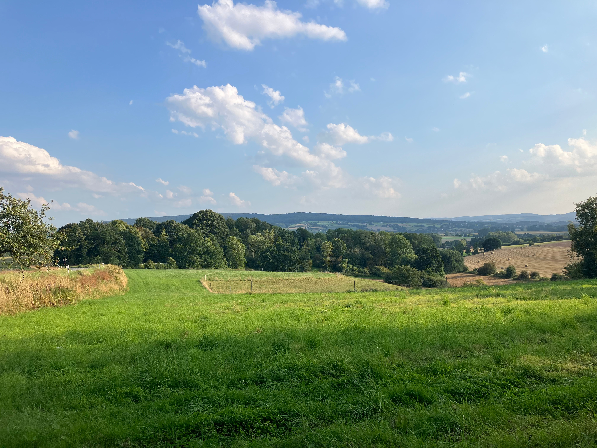

+++
date = '2026-04-27T18:04:40+02:00'
draft = true
title = 'New Blog'
tags = ["blog"]
+++
## Who dis?

It's my new blog! Or something like that.

Anyway, here's a small image.

And a big image.

Quod erat optandum maxime, iudices, et quod unum ad invidiam vestri ordinis infamiamque iudiciorum sedandam maxime pertinebat, id non humano consilio, sed prope divinitus datum atque oblatum vobis summo rei publicae tempore videtur. Inveteravit enim iam opinio perniciosa rei publicae, vobisque periculosa, quae non modo apud populum Romanum, sed etiam apud exteras nationes, omnium sermone percrebruit: his iudiciis quae nunc sunt, pecuniosum hominem, quamvis sit nocens, neminem posse damnari. Nunc, in ipso discrimine ordinis iudiciorumque vestrorum, cum sint parati qui contionibus et legibus hanc invidiam senatus inflammare conentur, in iudicium adductus est [C. Verres], homo vita atque factis omnium iam opinione damnatus, pecuniae magnitudine sua spe et praedicatione absolutus. Huic ego causae, iudices, cum summa voluntate et expectatione populi Romani, actor accessi, non ut augerem invidiam ordinis, sed ut infamiae communi succurrerem. Adduxi enim hominem in quo reconciliare existimationem iudiciorum amissam, redire in gratiam cum populo Romano, satis facere exteris nationibus, possetis; depeculatorem aerari, vexatorem Asiae atque Pamphyliae, praedonem iuris urbani, labem atque perniciem provinciae Siciliae. De quo si vos vere ac religiose iudicaveritis, auctoritas ea, quae in vobis remanere debet, haerebit; sin istius ingentes divitiae iudiciorum religionem veritatemque perfregerint, ego hoc tam adsequar, ut iudicium potius rei publicae, quam aut reus iudicibus, aut accusator reo, defuisse videatur.

Equidem, ut de me confitear, iudices, cum multae mihi a C. Verre insidiae terra marique factae sint, quas partim mea diligentia devitarim, partim amicorum studio officioque repulerim; numquam tamen neque tantum periculum mihi adire visus sum, neque tanto opere pertimui, ut nunc in ipso iudicio. Neque tantum me exspectatio accusationis meae, concursusque tantae multitudinis (quibus ego rebus vehementissime perturbor) commovet, quantum istius insidiae nefariae, quas uno tempore mihi, vobis, M'. Glabrioni, populo Romano, sociis, exteris nationibus, ordini, nomini denique senatorio, facere conatur: qui ita dictitat, eis esse metuendum, qui quod ipsis solis satis esset surripuissent; se tantum eripuisse, ut id multis satis esse possit; nihil esse tam sanctum quod non violari, nihil tam munitum quod non expugnari pecunia possit. Quod si quam audax est ad conandum, tam esset obscurus in agendo, fortasse aliqua in re nos aliquando fefellisset. Verum hoc adhuc percommode cadit, quod cum incredibili eius audacia singularis stultitia coniuncta est. Nam, ut apertus in corripiendis pecuniis fuit, sic in spe corrumpendi iudici, perspicua sua consilia conatusque omnibus fecit. Semel, ait, se in vita pertimuisse, tum cum primum a me reus factus sit; quod, cum e provincia recens esset, invidiaque et infamia non recenti, sed vetere ac diuturna flagraret, tum, ad iudicium corrumpendum, tempus alienum offenderet. Itaque, cum ego diem in Siciliam inquirendi perexiguam postulavissem, invenit iste, qui sibi in Achaiam biduo breviorem diem postularet, — non ut is idem conficeret diligentia et industria sua quod ego meo labore et vigiliis consecutus sum, etenim ille Achaicus inquisitor ne Brundisium quidem pervenit; ego Siciliam totam quinquaginta diebus sic obii, ut omnium populorum privatorumque literas iniuriasque cognoscerem; ut perspicuum cuivis esse posset, hominem ab isto quaesitum esse, non qui reum suum adduceret, sed qui meum tempus obsideret.
